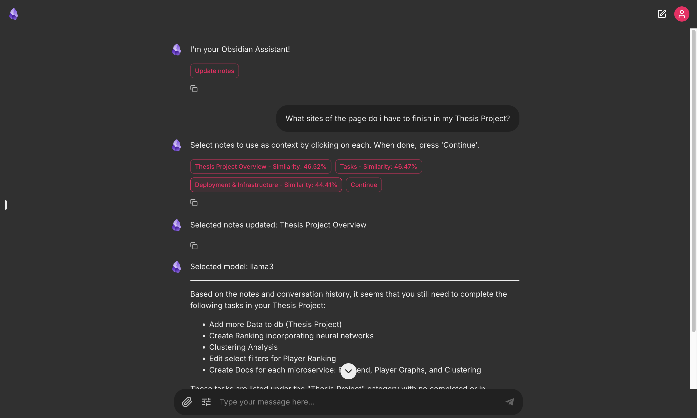
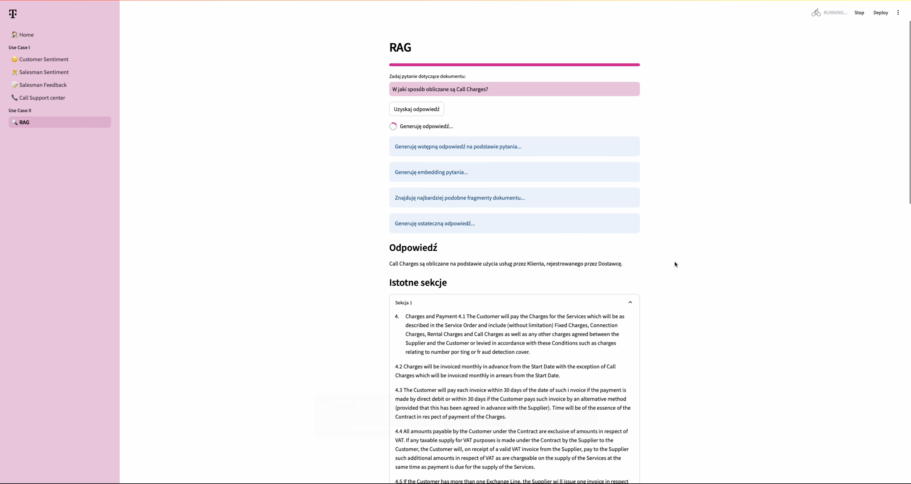

# Welcome to my profile!

---

I'm a Telecommunications student at Warsaw University of Technology, specializing in Teleinformatics. Passionate about **DevOps technologies**, **CI/CD**, **Kubernetes**, **AI chatbots**, and **Machine Learning**. Currently, I'm working at **T-Mobile as a DevOps Junior**, where I’m honing my skills and working on exciting projects in the field.

---

## 🚀 Currently working on:
### 📊 Thesis Project
 I'm currently working on my thesis project, a microservices-based application for analyzing soccer player skills. This app combines Java Spring Boot, Python microservices for machine learning and data analysis, and PostgreSQL for data storage. It features a React frontend with a Text2SQL chatbot, player ranking, and skill clustering, all orchestrated with Kubernetes. CI/CD is managed through GitHub Actions and ArgoCD to ensure efficient deployment and updates.

## 🔧 Technologies & Tools

  &nbsp;
  &nbsp;
  &nbsp;
  &nbsp;
  &nbsp;
  &nbsp;
  &nbsp;

## 💼 Some of my projects:
- **[ObsidianMD Chatbot / Python, Chainlit, OpenAIAPI, Electron](https://github.com/perrohombre/ObsidianMD_Chatbot)**: This desktop application, built with Chainlit and powered by Electron, enables an AI chatbot to interact with an Obsidian vault, allowing users to query notes, access task lists, and retrieve relevant information from their knowledge base.

- **[AI CHALLENGE II / Python, Streamlit, AzureOpenAI](https://github.com/perrohombre/AI-CHALLENGE-II)**: Developed for T-Mobile’s AI Innovation Challenge II, this AI application provides real-time sentiment analysis and document search using models like GPT-4, Whisper, and Text-to-Speech through Azure OpenAI.

- **[Football Stats App / Django, React](https://github.com/perrohombre/football-stats-app)**: Developed for a university project, this basic web application enables users to view football leagues and player statistics, including goals and assists.

___

