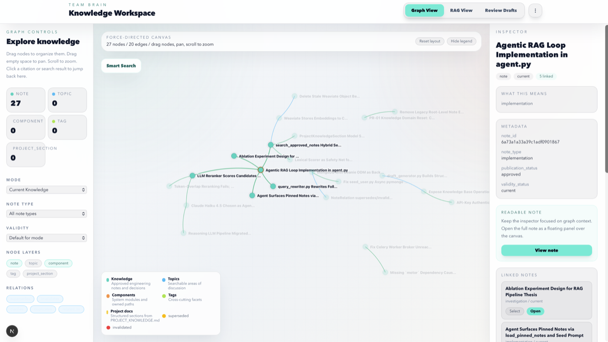

# Aleksander Gajowniczek

**AI Engineer @ Procter &amp; Gamble**

I build production AI systems end to end — from LLM-based agentic workflows and RAG pipelines to the platforms that serve them. At P&G I've worked on both ends of that stack: an internal multi-provider GenAI platform on Kubernetes, and agentic AI solutions used daily by engineering teams.

I follow the AI space closely — new models, agent frameworks, and tooling — and enjoy trying things early and turning them into something teams actually use.

Currently finishing my M.Sc. in Teleinformatics and Cybersecurity at the Warsaw University of Technology.

📫 [ag.gajowniczek@gmail.com](mailto:ag.gajowniczek@gmail.com) &nbsp;·&nbsp; 💼 [LinkedIn](https://www.linkedin.com/in/aleksander-gajowniczek-73788426b/)

---

## 🧠 Team Brain

> **[perrohombre/TEAM_BRAIN](https://github.com/perrohombre/TEAM_BRAIN)** — master's thesis project

A RAG-based knowledge management system for development teams. Notes are vectorized, linked into a knowledge graph, and served to both a web frontend and IDE agents.

- **Agentic retrieval** — a tool-use loop that decides how to search instead of running a single fixed query
- **Hybrid search** — vector + keyword retrieval over Weaviate
- **Knowledge-graph frontend** — notes and their relations are browsable, not just searchable
- **MCP server** — exposes the whole knowledge base to IDE agents through the Model Context Protocol
- **Evaluated with a systematic ablation study** of the individual pipeline components

`FastAPI` `MongoDB` `Weaviate` `Anthropic Claude` `Next.js` `MCP`

---

## 🪐 AstroBridge

> **[kubamale/BHL-SW-BONSAI](https://github.com/kubamale/BHL-SW-BONSAI)** — winner, Best Hacking League 2024 (BEST, P&G, 42 Warsaw)

A time synchronization system between Earth (Gregorian calendar) and Mars (Darian calendar), letting you manage events across both planetary time systems — precise time conversion, a RESTful API for event handling, and real-time synchronization.

`Spring Boot` `Next.js` `React` `TypeScript` `MySQL`

---

## 🔧 Tech I work with

**Languages** — Python, Java, TypeScript, Bash

**AI / LLM** — OpenAI, Azure OpenAI, Anthropic Claude, Google Gemini, RAG, embeddings &amp; vector search (Weaviate), agentic workflows, Model Context Protocol (MCP), prompt engineering

**Platform** — Kubernetes, Docker, GitHub Actions, Azure, GCP, Databricks, FastAPI, MongoDB, PostgreSQL, Redis, Celery, ELK, Linux

  &nbsp;
  &nbsp;
  &nbsp;
  &nbsp;
  &nbsp;
  &nbsp;
  &nbsp;
  &nbsp;
  &nbsp;
  &nbsp;
  &nbsp;
  &nbsp;
  &nbsp;
  &nbsp;

